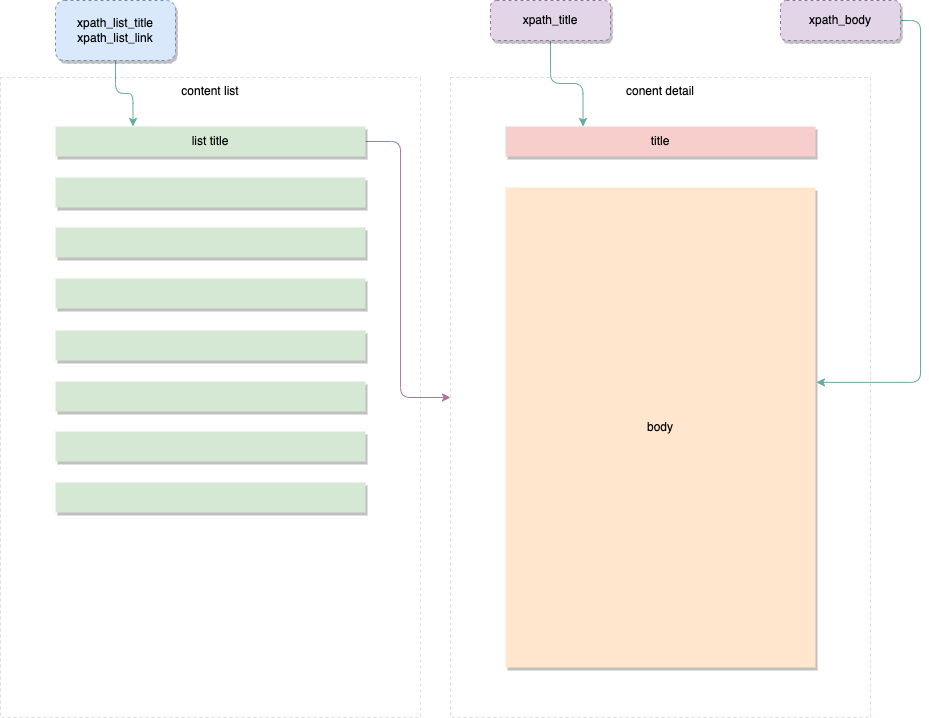

# MiniCrawling
```json
[
  {
    "site_name": "website name",
    "site_url": "website url",
    "list_type": "html|json",
    "xpath_list_link": "",
    "xpath_list_title": "",
    "xpath_title": "",
    "xpath_body": "",
    "processor": "",
    "crawler": "",
    "skip_filter": 1
  }
]
```
